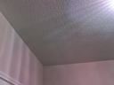
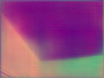
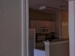
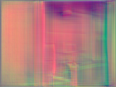
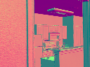
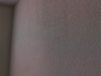
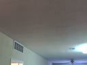
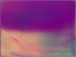

# NormalMapTFJS (Alpha version)

Normal map from rgb image

# Demo

generate https keys

```
cd httpsKeys
```

```
sudo openssl req -x509 -nodes -days 365 -newkey rsa:2048 -keyout ./selfsigned.key -out selfsigned.crt
```

run demo server

```
sudo node index
```

# examples















